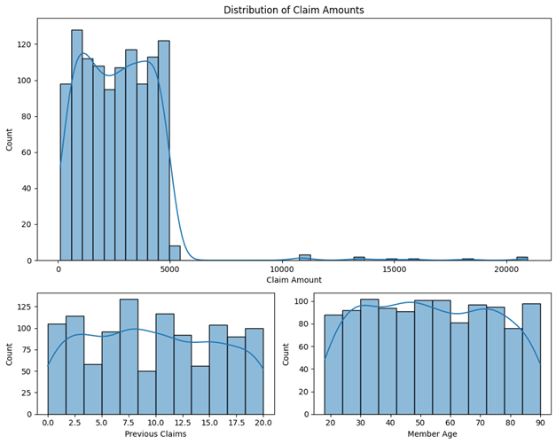
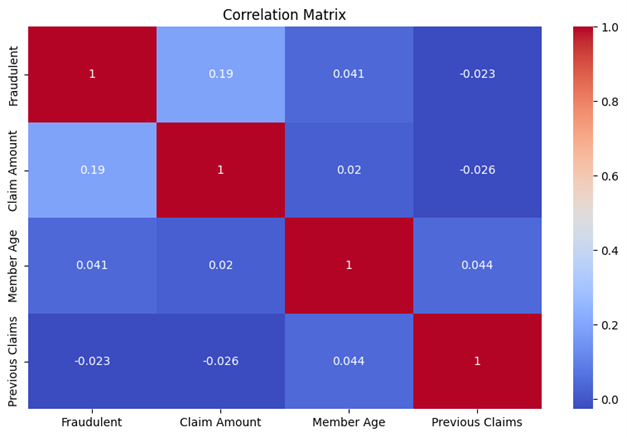

# FWA(Fraud Waste and Abuse) Claims Modelling

[](https://www.python.org/)

## Overview
This project focuses on detecting **Fraud, Waste, and Abuse (FWA)** in health insurance claims using mathematical and machine learning models. The dataset consists of health insurance claims, which contain various features like claim amount, diagnosis codes, procedure codes, and more. The primary goal is to identify fraudulent claims and develop a risk scoring system to prioritize claims for further investigation.

## Dataset
The dataset includes the following columns:
- `Claim ID`: Unique identifier for each claim
- `Member ID`: Unique identifier for each policyholder
- `Claim Amount`: Total amount of the claim
- `Diagnosis Code`: ICD-10 codes for diagnosis
- `Procedure Code`: CPT codes for procedures performed
- `Provider ID`: Unique identifier for healthcare provider
- `Date of Service`: Date when the service was provided
- `Claim Submission Date`: Date when the claim was submitted
- `Previous Claims`: Number of claims previously filed by the member
- `Member Age`: Age of the policyholder
- `Location`: Geographic location of the provider (urban/rural)

## Methodology
### 1. **Data Preprocessing**
- Date columns were converted to a standard datetime format.
- Categorical data was standardized (e.g., location).
- Invalid data, such as zero procedure codes, was removed.
- Missing data was handled to ensure data consistency.

### 2. **Exploratory Data Analysis**
- Visualizations like histograms were used to understand claim amounts, member age, and the number of previous claims.



- A correlation matrix was used to understand relationships between numerical features and fraudulent claims.
  


### 3. **Modeling**
A **Random Forest Classifier** was used to predict fraudulent claims based on:
- Claim Amount
- Member Age
- Number of Previous Claims
- Location

New features were engineered for better model performance:
- `High Claim Flag`: Indicates claims with amounts exceeding two standard deviations above the mean.
- `Member Claims Frequency`: Tracks the number of claims submitted by each member.
- `Provider Claims Frequency`: Tracks the number of claims submitted by each provider.

### 4. **Risk Scoring**
A risk scoring system was developed to rank claims by their likelihood of being fraudulent. Claims with higher scores were flagged for further investigation.

| Random Forest 1 claims Likelihood |                          |                         |                       | Random Forest 2 claims Likelihood |                          |                         |                       |
|-----------------------------------|--------------------------|-------------------------|-----------------------|-----------------------------------|--------------------------|-------------------------|-----------------------|
| Claim ID                          | Claim Amount              | Risk Score              | Previous Claims        | Claim ID                          | Claim Amount              | Risk Score              | Previous Claims        |
| 65                                | 10,797                    | 1.00                    | 6                     | 84                                | 15,883                    | 1.00                    | 0                     |
| 93                                | 20,859                    | 0.98                    | 10                    | 65                                | 10,797                    | 1.00                    | 6                     |
| 36                                | 18,194                    | 0.97                    | 5                     | 93                                | 20,859                    | 1.00                    | 10                    |
| 69                                | 13,617                    | 0.96                    | 7                     | 81                                | 11,071                    | 0.98                    | 0                     |
| 33                                | 20,951                    | 0.96                    | 8                     | 69                                | 13,617                    | 0.97                    | 7                     |
| 84                                | 15,883                    | 0.96                    | 0                     | 36                                | 18,194                    | 0.97                    | 5                     |
| 80                                | 14,752                    | 0.95                    | 3                     | 82                                | 13,270                    | 0.96                    | 2                     |
| 82                                | 13,270                    | 0.94                    | 2                     | 33                                | 20,951                    | 0.96                    | 8                     |
| 81                                | 11,071                    | 0.92                    | 0                     | 17                                | 10,778                    | 0.94                    | 8                     |
| 17                                | 10,778                    | 0.91                    | 8                     | 0                                 | 3,699                     | 0.92                    | 4                     |


### 5. **Model Evaluation**
The model's performance was evaluated using precision, recall, accuracy, and confusion matrix metrics. The main challenge was identifying fraudulent claims due to class imbalance.

| Model        | Accuracy | Precision (Class 0) | Recall (Class 1) |
|--------------|----------|--------------------|-----------------|
| RandomForest v1 | 92.41%   | 92%                | 15%             |
| RandomForest v2 | 92.86%   | 93%                | 25%             |

## Recommendations
- **Improving Recall**: Further feature engineering and adjusting the model's sensitivity could help improve recall for fraudulent claims.
A few echiques for future implementation could include:
	1. SMOTE
- **Continuous Monitoring**: The model should be updated regularly with new data and performance monitoring.

## How to Use


1. Clone the repository:
   ```bash
   git clone https://github.com/cmosongo/fwa-claims-modelling.git
   ```
2. Install the required packages:
   ```bash
   pip install -r requirements.txt
   ```
3. Run the Jupyter notebook:
   ```bash
   jupyter notebook FWA_Modelling.ipynb
   ```

## with a `.venv`

After cloning the repository, `cd` into the repo from your terminal and follow the steps below:

1. Create virtual environment 
	```bash
	python3 -m venv .venv
	```

2. Activate virtual environment 

	> Linux/MAC
	```bash
	(.venv)$ .venv/bin/activate
	```

	> Windows
	Command Prompt:
	```bash
	(.venv)> .venv\Scripts\activate
	```

	PowerShell:
	```bash
	(.venv)PS> .\.venv\Scripts\Activate
	```

3. To use nootebooks:

	```bash
	(.venv)> pip install ipykernel
	```

4. To run the notebook, run the folliwing command to add the virtual environment to jupyter kernel

	```bash
	python -m ipykernel install --user --name=.venv --display-name "FWA Claims Analysis"
	```


5. Install the required packages 
	```bash
	(.venv)> pip install -r requirements.txt
	```

6. Deactivating the virtual environment

	 ```bash
	 deactivate
	 ```


